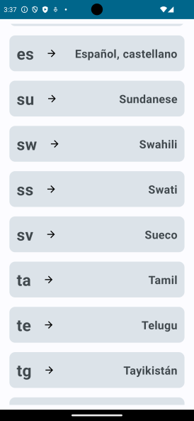
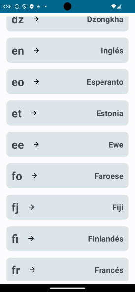
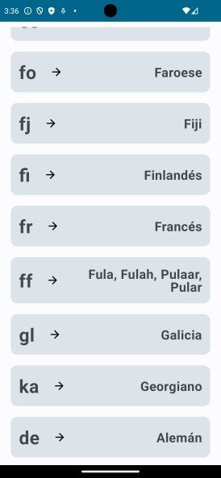

# Idiomas ISO-639-1

ISO 639-1 es la primera parte del código ISO 639. Consiste en 184 códigos de dos letras usados para identificar los principales idiomas del mundo. Estos códigos son una taquigrafía internacional muy útil para indicar idiomas. Por ejemplo:

- El español está representado por es
- El inglés está representado por en
- El alemán está representado por de (del endónimo Deutsch)
- El japonés está representado por ja (aunque su endónimo es Nihongo)

La lista de códigos ISO 639-1 se convirtió en norma oficial en 2002, aunque ha existido en formato borrador desde hace años. El último código añadido fue ht, representando al criollo haitiano el 26 de febrero de 2003. El uso de la norma fue apoyado por IETF language tags, introducido por RFC 1766 en marzo de 1995, y continuado por RFC 3066 en enero de 2001 y por RFC 4646 en septiembre de 2006.

### Probando

Desde android usando Compose y kotlin

## Endpoint

[](https://juanmedina100.github.io/idiomas-iso-639-1-json/idiomas-639-1.json)Idiomas

ApiService:
```kotlin
@GET("idiomas-639-1.json")
suspend fun getAllIdiomas():IdiomasDto
```

## Capturas





